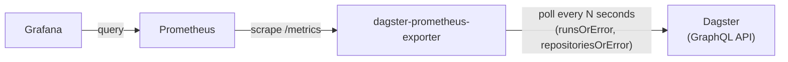

# dagster-prometheus-exporter

[](https://github.com/HirofumiTsuda/dagster-prometheus-exporter/actions/workflows/ci.yml)
[](https://goreportcard.com/report/github.com/HirofumiTsuda/dagster-prometheus-exporter)
[](LICENSE)

A Prometheus exporter for [Dagster](https://dagster.io/) run metrics. It polls Dagster's GraphQL API on an interval and exposes run counts, statuses, and code-location information as Prometheus metrics.

## Motivation

Dagster doesn't expose a native Prometheus metrics endpoint. The commonly suggested workaround is to push metrics from inside a run to a [Pushgateway](https://github.com/prometheus/pushgateway) using the [`dagster-prometheus`](https://docs.dagster.io/integrations/libraries/prometheus) resource, but that doesn't fit what we actually want to monitor:

1. Prometheus's own documentation discourages using the Pushgateway as a general pull-to-push workaround — it's meant only for short-lived batch jobs that genuinely can't be scraped, not as a substitute for exposing a scrapeable endpoint.
2. A push happens from code running *inside* a run. If a run is OOM-killed (or otherwise crashes) before it gets there, nothing is ever pushed — so exactly the failure you most want visibility into goes unobserved.
3. Runs sitting in the queue haven't started executing any user code yet, so there's no push to make at all — a push-based approach has no way to report run-queue backlog.

This exporter instead polls Dagster's GraphQL API directly and derives every metric (including queued/active runs) from Dagster's own run state, so none of the above gaps apply.

## Architecture



The exporter is a single Go binary with no external state store — everything it reports is held in memory and rebuilt on each scrape:

- `cmd/exporter` — entrypoint; loads config and starts the server.
- `internal/config` — reads settings from environment variables.
- `internal/server` — runs the HTTP server (`/metrics`, `/healthz`, `/readyz`) and a background ticker that triggers a scrape on `DAGSTER_SCRAPING_INTERVAL_SECONDS`.
- `internal/collector` — on each scrape, queries Dagster's GraphQL API (active runs, completed runs, and the job/code-location roster) and updates the in-memory state behind a mutex; `DagsterCollector` implements `prometheus.Collector` and renders that state into metrics whenever Prometheus scrapes `/metrics`.

Because scraping (writing state) and metrics rendering (reading state) are decoupled, a slow or failing Dagster GraphQL call never blocks or breaks a `/metrics` request — it just serves the last known state.

## Metrics

All metrics are labeled with `job_name` and `location` (the Dagster code location the job belongs to), so that jobs with the same name in different code locations don't collide.

| Metric | Type | Labels | Description |
| --- | --- | --- | --- |
| `dagster_active_runs` | Gauge | `job_name`, `location`, `status` | Number of currently active runs (`queued`, `starting`, `started`) per job. Jobs with no active runs are reported as `0` rather than omitted. |
| `dagster_completed_runs_total` | Counter | `job_name`, `location`, `status` | Total number of completed runs (`success`, `failure`) per job, since the exporter started. Jobs that have never run are seeded at `0`. Series for jobs that no longer exist in Dagster are deleted automatically. |
| `dagster_last_run_info` | Gauge | `job_name`, `location`, `status` | Always `1`; an "info" metric (same pattern as `kube_pod_info`) reporting the status of the most recently completed run per job within the lookback window. Use the `status` label to tell success from failure, e.g. in a Grafana table panel. |

The exporter also exposes `/healthz` (process liveness) and `/readyz` (checks connectivity to the Dagster GraphQL endpoint).

## Usage

Build and run the binary directly:

```sh
go build -o exporter ./cmd/exporter
DAGSTER_GRAPHQL_ENDPOINT=http://localhost:3000/graphql ./exporter
```

Or with Docker:

```sh
docker build -f docker/exporter.Dockerfile -t dagster-prometheus-exporter .
docker run -p 9101:9101 -e DAGSTER_GRAPHQL_ENDPOINT=http://dagster:3000/graphql dagster-prometheus-exporter
```

Metrics are then available at `http://localhost:9101/metrics`.

### Configuration

All configuration is via environment variables (see `internal/config/config.go`):

| Variable | Default | Description |
| --- | --- | --- |
| `PORT` | `9101` | Port the exporter listens on. |
| `DAGSTER_GRAPHQL_ENDPOINT` | `http://127.0.0.1:3000/graphql` | URL of the Dagster GraphQL API to poll. |
| `LOOKBACK_WINDOW_MINUTES` | `720` (12h) | How far back to look for completed runs on each scrape. |
| `CACHE_TTL_MINUTES` | `1440` (24h) | How long a completed run's ID is remembered, to avoid double-counting `dagster_completed_runs_total`. |
| `DAGSTER_SCRAPING_INTERVAL_SECONDS` | `15` | How often the exporter polls Dagster's GraphQL API. |

## Local development

`docker-compose.yaml` spins up a full local stack for trying the exporter end-to-end: a `dagster dev` instance with sample jobs (`dev/dagster_workspace/`), the exporter itself, Prometheus, and Grafana (with a pre-provisioned dashboard).

```sh
docker compose up --build
```

| Service | URL | Notes |
| --- | --- | --- |
| Dagster UI | http://localhost:3000 | Sample jobs defined in `dev/dagster_workspace/`. |
| Exporter metrics | http://localhost:9101/metrics | |
| Prometheus | http://localhost:9090 | Scrapes the exporter using `dev/prometheus/prometheus.docker.yml`. |
| Grafana | http://localhost:3001 | Login `root` / `passw0rd` (local dev only). Dashboard "Dagster Run Monitoring" is auto-provisioned from `dev/grafana/dashboards/dagster-dashboard.json`. |

If you're running the exporter directly on the host (not via `docker compose`) against the Dockerized Dagster/Prometheus stack, use `dev/prometheus/prometheus.host.yml` instead, which scrapes the host via its Docker bridge IP.

### Running tests

```sh
go build ./...
go vet ./...
golangci-lint run ./...
go test ./...
```

CI (`.github/workflows/ci.yml`) runs all of the above on every push and pull request.

## License

MIT — see [LICENSE](LICENSE).
