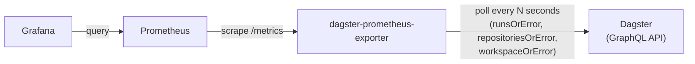

# dagster-prometheus-exporter

[](https://github.com/HirofumiTsuda/dagster-prometheus-exporter/releases/latest)
[](https://github.com/HirofumiTsuda/dagster-prometheus-exporter/actions/workflows/ci.yml)
[](https://github.com/HirofumiTsuda/dagster-prometheus-exporter/actions/workflows/helm-e2e.yml)
[](https://github.com/HirofumiTsuda/dagster-prometheus-exporter/actions/workflows/helm-published-smoke.yml)
[](https://artifacthub.io/packages/helm/dagster-prometheus-exporter/dagster-prometheus-exporter)
[](https://codecov.io/gh/HirofumiTsuda/dagster-prometheus-exporter)
[](https://github.com/HirofumiTsuda/dagster-prometheus-exporter/actions/workflows/codeql.yml)
[](go.mod)
[](https://pkg.go.dev/github.com/HirofumiTsuda/dagster-prometheus-exporter)
[](LICENSE)

A Prometheus exporter for [Dagster](https://dagster.io/). It polls Dagster's GraphQL API on an interval and exposes run counts, statuses and durations, schedule and sensor state, run-queue backlog, and code-location load errors as Prometheus metrics.


## Table of Contents

- [Quick Start](#quick-start)
- [Compatibility](#compatibility)
- [Motivation](#motivation)
- [Architecture](#architecture)
- [Metrics](#metrics)
- [Endpoints](#endpoints)
- [Usage](#usage)
- [Local development](#local-development)
- [Roadmap](#roadmap)
- [License](#license)

## Quick Start

`docker compose up` brings up the entire stack in one shot — a `dagster dev` instance with sample jobs, this exporter, Prometheus, and Grafana with the dashboard above pre-provisioned. No manual setup required.

```sh
docker compose up --build
```

| Service | URL | Notes |
| --- | --- | --- |
| Dagster UI | http://localhost:3000 | Sample jobs defined in `dev/dagster_workspace/`. |
| Exporter metrics | http://localhost:9101/metrics | |
| Prometheus | http://localhost:9090 | Scrapes the exporter using `dev/prometheus/prometheus.docker.yml`. |
| Grafana | http://localhost:3001 | Login `root` / `passw0rd` (local dev only). Dashboard "Dagster Run Monitoring" is auto-provisioned from `dev/grafana/dashboards/dagster-dashboard.json`. |

## Compatibility

Tested against Dagster **1.13.15** (the version pinned in `pyproject.toml`/`uv.lock` for the local dev stack). Dagster's GraphQL API isn't a stable, versioned contract — fields and types can change between releases — so this exporter isn't guaranteed to work against significantly older or newer Dagster versions. If you hit a GraphQL error running against a different version, please [open an issue](https://github.com/HirofumiTsuda/dagster-prometheus-exporter/issues/new/choose).

## Motivation

Dagster doesn't expose a native Prometheus metrics endpoint. The commonly suggested workaround is to push metrics from inside a run to a [Pushgateway](https://github.com/prometheus/pushgateway) using the [`dagster-prometheus`](https://docs.dagster.io/integrations/libraries/prometheus) resource, but that doesn't fit what we actually want to monitor:

1. Prometheus's own documentation discourages using the Pushgateway as a general pull-to-push workaround — it's meant only for short-lived batch jobs that genuinely can't be scraped, not as a substitute for exposing a scrapeable endpoint.
2. A push happens from code running *inside* a run. If a run is OOM-killed (or otherwise crashes) before it gets there, nothing is ever pushed — so exactly the failure you most want visibility into goes unobserved.
3. Runs sitting in the queue haven't started executing any user code yet, so there's no push to make at all — a push-based approach has no way to report run-queue backlog.

This exporter instead polls Dagster's GraphQL API directly and derives every metric (including queued/active runs) from Dagster's own run state, so none of the above gaps apply.

## Architecture



A single Go binary with no external state store: it polls Dagster's GraphQL API on an interval, keeps the result in memory, and serves it from `/metrics`. Scraping (writing that state) and serving `/metrics` (reading it) are decoupled, so a slow or failing Dagster GraphQL call never blocks or breaks a `/metrics` request — it just serves the last known state. Five collectors (definitions roster, active runs, completed runs, code-location load status, daemon health) run concurrently on every scrape.

For the package layout, why there are four separate collectors, and how completed-run fetching stays incremental instead of re-scanning everything every cycle, see [docs/architecture.md](docs/architecture.md).

## Metrics

The per-job metrics are labeled with `job_name` and `location` (the Dagster code location the job belongs to), so that jobs with the same name in different code locations don't collide.

Full label reference, edge cases, and design rationale for every metric below: [docs/metrics.md](docs/metrics.md).

| Metric | Type | Description |
| --- | --- | --- |
| `dagster_active_runs` | Gauge | Currently active runs (`queued`/`starting`/`started`) per job. |
| `dagster_active_run_duration_seconds` | Gauge | How long the oldest active run in a job/status has been there — a signal for stuck runs and queue backlogs. |
| `dagster_completed_runs_total` | Counter | Completed runs (`success`/`failure`) per job, since the exporter started. |
| `dagster_last_run_info` | Gauge | Status of each job's most recently completed run (always `1`; status is in the `status` label). |
| `dagster_last_run_duration_seconds` | Gauge | Duration of each job's most recently completed run. |
| `dagster_daemon_healthy` | Gauge | Whether each Dagster daemon is alive — the only metric that sees a dead scheduler. |
| `dagster_daemon_last_heartbeat_timestamp_seconds` | Gauge | When each daemon last reported a heartbeat. |
| `dagster_code_location_load_error` | Gauge | Whether a code location most recently failed to load. |
| `dagster_run_queue_concurrency_key_backlog` | Gauge | Runs queued behind a tag-based run-queue concurrency limit, per `dagster/concurrency_key` value. |
| `dagster_schedule_status` | Gauge | Whether a schedule is currently on or off. |
| `dagster_schedule_last_tick_status` | Gauge | Outcome of a schedule's most recent tick. |
| `dagster_sensor_status` | Gauge | Whether a sensor is currently on or off. |
| `dagster_sensor_last_tick_status` | Gauge | Outcome of a sensor's most recent tick. |

### Exporter self-health

These report on the exporter itself rather than on Dagster's run state. The first three are labeled `collector` (one of `definitions_roster`, `active_runs`, `completed_runs`, `code_location_status` — see [docs/architecture.md](docs/architecture.md)).

| Metric | Type | Description |
| --- | --- | --- |
| `dagster_exporter_scrape_duration_seconds` | Gauge | Duration of that collector's most recent scrape. |
| `dagster_exporter_last_scrape_success` | Gauge | `1` if that collector's most recent scrape succeeded, `0` if it failed. |
| `dagster_exporter_scrape_errors_total` | Counter | Total failed scrapes for that collector, since the exporter started. |
| `dagster_exporter_build_info` | Gauge | Always `1`; exporter version/commit as labels (`node_exporter`-style build-info idiom). |

### Example output

```
dagster_active_runs{job_name="heavy_job",location="dev-dagster-workspace",status="queued"} 0
dagster_active_runs{job_name="heavy_job",location="dev-dagster-workspace",status="started"} 1
dagster_active_runs{job_name="heavy_job",location="dev-dagster-workspace",status="starting"} 0

dagster_active_run_duration_seconds{job_name="heavy_job",location="dev-dagster-workspace",status="queued"} 0
dagster_active_run_duration_seconds{job_name="heavy_job",location="dev-dagster-workspace",status="started"} 5.761711018
dagster_active_run_duration_seconds{job_name="heavy_job",location="dev-dagster-workspace",status="starting"} 0

dagster_completed_runs_total{job_name="heavy_job",location="dev-dagster-workspace",status="failure"} 0
dagster_completed_runs_total{job_name="heavy_job",location="dev-dagster-workspace",status="success"} 12
dagster_completed_runs_total{job_name="failing_job",location="dev-dagster-workspace",status="failure"} 3

dagster_last_run_info{job_name="heavy_job",location="dev-dagster-workspace",status="success"} 1
dagster_last_run_info{job_name="failing_job",location="dev-dagster-workspace",status="failure"} 1

dagster_last_run_duration_seconds{job_name="heavy_job",location="dev-dagster-workspace",status="success"} 32.34893083572388

dagster_run_queue_concurrency_key_backlog{concurrency_key="heavy_limit"} 3

dagster_schedule_status{schedule_name="daily_refresh",location="dev-dagster-workspace",status="running"} 1

dagster_schedule_last_tick_status{schedule_name="daily_refresh",location="dev-dagster-workspace",status="success"} 1

dagster_sensor_status{sensor_name="new_file_sensor",location="dev-dagster-workspace",status="running"} 1

dagster_sensor_last_tick_status{sensor_name="new_file_sensor",location="dev-dagster-workspace",status="skipped"} 1
```

### PromQL examples

```promql
# Total active runs across all jobs
sum(dagster_active_runs)

# Failed runs in the last hour, by job
sum by (job_name) (increase(dagster_completed_runs_total{status="failure"}[1h]))

# Success rate over the last 5 minutes
sum(rate(dagster_completed_runs_total{status="success"}[5m]))
/
sum(rate(dagster_completed_runs_total[5m]))

# Jobs whose last run failed
dagster_last_run_info{status="failure"}

# Alert: some job has a run that's been stuck in QUEUED for over 10 minutes.
# dagster_active_runs alone can't tell "5 runs queued, all fine, just churning
# through fast" apart from "5 runs queued, one of them stuck for 2 hours" —
# both look like active_runs{status="queued"} == 5. This catches the latter.
dagster_active_run_duration_seconds{status="queued"} > 600

# Slowest jobs by their most recent run duration
topk(5, dagster_last_run_duration_seconds)

# Which concurrency keys currently have a run-queue backlog
dagster_run_queue_concurrency_key_backlog > 0

# Schedules that are turned on but whose last tick wasn't a success
# (covers both a hard failure and a skip)
dagster_schedule_status{status="running"} == 1
and on (schedule_name, location)
dagster_schedule_last_tick_status{status!="success"} == 1

# Sensors that are turned on but whose last tick was a hard failure
# (unlike schedules, "skipped" is a normal, common outcome for a sensor —
# it just means nothing matched that evaluation — so this only flags failure)
dagster_sensor_status{status="running"} == 1
and on (sensor_name, location)
dagster_sensor_last_tick_status{status="failure"} == 1
```

## Endpoints

| Endpoint | Purpose | Example response |
| --- | --- | --- |
| `GET /metrics` | Prometheus exposition of all metrics above. | See [Example output](#example-output). |
| `GET /healthz` | Liveness probe. Always returns `200` as long as the process is up — it does not check Dagster connectivity, so it's safe to use for a container/k8s liveness check that shouldn't restart the pod just because Dagster is unreachable. | `200` `{"status":"healthy"}` |
| `GET /readyz` | Readiness probe. Calls Dagster's GraphQL API and returns `200` only if it responds, `503` otherwise — use this (not `/healthz`) to gate traffic/scrape readiness on Dagster actually being reachable. On success, the response body also includes the connected Dagster instance's version. | `200` `{"status":"OK","version":"1.13.15"}`, or `503` `{"status":"NOT_READY","error":"..."}` |

## Usage

Install directly with Go:

```sh
go install github.com/HirofumiTsuda/dagster-prometheus-exporter/cmd/exporter@latest
DAGSTER_GRAPHQL_ENDPOINT=http://localhost:3000/graphql exporter
```

Or clone and build it yourself:

```sh
go build -o exporter ./cmd/exporter
DAGSTER_GRAPHQL_ENDPOINT=http://localhost:3000/graphql ./exporter
```

Or pull the published image from GHCR:

```sh
docker run -p 9101:9101 -e DAGSTER_GRAPHQL_ENDPOINT=http://dagster:3000/graphql ghcr.io/hirofumitsuda/dagster-prometheus-exporter:latest
```

Or build it yourself:

```sh
docker build -f docker/exporter.Dockerfile -t dagster-prometheus-exporter .
docker run -p 9101:9101 -e DAGSTER_GRAPHQL_ENDPOINT=http://dagster:3000/graphql dagster-prometheus-exporter
```

Or deploy to Kubernetes with the [Helm chart](charts/dagster-prometheus-exporter) ([Artifact Hub listing](https://artifacthub.io/packages/helm/dagster-prometheus-exporter/dagster-prometheus-exporter)), published as an OCI artifact on GHCR:

```sh
helm install my-dagster-exporter oci://ghcr.io/hirofumitsuda/charts/dagster-prometheus-exporter \
  --version 0.1.3 \
  --set env.DAGSTER_GRAPHQL_ENDPOINT=http://dagster-webserver.dagster.svc.cluster.local/graphql
```

Metrics are then available at `http://localhost:9101/metrics`.

### Configuration

All configuration is via environment variables (see `internal/config/config.go`):

| Variable | Default | Description |
| --- | --- | --- |
| `PORT` | `9101` | Port the exporter listens on. |
| `DAGSTER_GRAPHQL_ENDPOINT` | `http://127.0.0.1:3000/graphql` | URL of the Dagster GraphQL API to poll. |
| `LOOKBACK_WINDOW_MINUTES` | scraping interval | How far back to look for completed runs on the very first scrape only. After that, completed runs are fetched incrementally from the last-seen update time (see [Architecture](#architecture)), so this only matters for the initial backfill on startup. |
| `CACHE_TTL_MINUTES` | 20x the scraping interval | How long a completed run's ID is remembered, to avoid double-counting `dagster_completed_runs_total`. A still-relevant run gets touched (its TTL refreshed) on every scrape, so this really just bounds how many consecutive missed/failed scrapes are tolerated before risking a double count on recovery. |
| `DAGSTER_SCRAPING_INTERVAL_SECONDS` | `15` | How often the exporter polls Dagster's GraphQL API. |
| `DAGSTER_SCRAPING_TIMEOUT_SECONDS` | `10` | Timeout for a full scrape cycle (all three collectors, run concurrently). |
| `RUNS_PAGE_SIZE` | `500` | Max runs requested per GraphQL call; larger result sets are paged through via cursor. |
| `RUNS_UPDATED_AFTER_SAFETY_MARGIN_MINUTES` | `5` | Overlap subtracted from the incremental fetch watermark, to tolerate runs whose DB commit lands slightly after their `updateTime`. |

## Local development

See [Quick Start](#quick-start) to bring up the full stack via `docker compose up --build`.

If you're running the exporter directly on the host (not via `docker compose`) against the Dockerized Dagster/Prometheus stack, use `dev/prometheus/prometheus.host.yml` instead, which scrapes the host via its Docker bridge IP.

### Importing the dashboard manually

If you already have your own Grafana/Prometheus and just want the dashboard, import the JSON directly:

1. In Grafana, go to **Dashboards → New → Import**.
2. Upload (or paste the contents of) [`dev/grafana/dashboards/dagster-dashboard.json`](dev/grafana/dashboards/dagster-dashboard.json).
3. Point it at a Prometheus data source that's scraping this exporter.

### Testing a broken code location

To see `dagster_code_location_load_error` actually report `1` (rather than trusting it blind), the repo ships a second, deliberately broken code location (`dev/broken_location/`) plus `dev/workspace.yaml`, which loads it alongside the normal one. It's opt-in: `docker compose up dagster` doesn't pass `-w`, so it keeps using pyproject.toml's `[tool.dagster]` section (the single healthy location) unless you explicitly load `dev/workspace.yaml`.

```sh
# Stop the compose-managed dagster container first if it's running, then:
docker compose run --rm --service-ports --name dagster-prometheus-exporter-dagster-1 dagster \
  uv run dagster dev -w /app/dev/workspace.yaml -h 0.0.0.0 -p 3000
```

Then point the exporter at it (either `DAGSTER_GRAPHQL_ENDPOINT=http://localhost:3000/graphql` on the host, or `http://dagster-prometheus-exporter-dagster-1:3000/graphql` from another container on the same compose network) and check `/metrics` for:

```
dagster_code_location_load_error{location="broken_location"} 1
dagster_code_location_load_error{location="dev-dagster-location"} 0
```

### Testing schedule/sensor tick status

Unlike the broken-code-location fixture above, these aren't opt-in. `dev/dagster_workspace/job.py` defines three instigators against a near-instant job, all with `default_status=RUNNING`, so the standard dev stack (`docker compose up`) starts ticking them automatically — no extra setup needed to see `dagster_schedule_status`/`dagster_schedule_last_tick_status`/`dagster_sensor_status`/`dagster_sensor_last_tick_status` report real data within a couple of minutes of startup.

Each produces a different tick status, so all three show up at once and an alert written against the `status` label can be tried out locally:

| Fixture | Tick status | Why |
| --- | --- | --- |
| `quick_job_schedule` | `success` | cron `* * * * *`, launches `quick_job` every minute |
| `quick_job_sensor` | `skipped` | `minimum_interval_seconds=30`, always returns a `SkipReason` |
| `failing_sensor` | `failure` | `minimum_interval_seconds=30`, always raises |

`failing_sensor` logs an error on every evaluation by design — intentional, like `failing_job` and the broken code location, not a sign the dev stack is misconfigured.

### Testing the Helm chart against a real Dagster (kind)

`.github/workflows/helm-e2e.yml` (status: see the badge at the top of this README) installs the chart into a [kind](https://kind.sigs.k8s.io/) cluster against a real Dagster instance and asserts `/readyz`/`/metrics` report real data — `helm lint`/`helm template` (in `helm-lint.yml`) only catch template syntax errors, not "does this chart actually work," and since the exporter image is always built fresh from the current checkout, this also exercises the Go server itself, not just the chart. The Dagster instance is a plain Deployment+Service (`dev/kubernetes/dagster-deployment.yaml`, running the same `docker/dagster-dev.Dockerfile` image as the `docker compose` dev stack) — a CI-only test fixture, not part of the chart itself. Both it and the exporter image are always built from the local checkout, never pulled from a registry, so the test validates the current state of `main`, not whatever was last published.

Runs daily on a schedule plus on-demand (`workflow_dispatch`), not on every push/PR: a full kind cluster spin-up is heavy to run per-PR, and being a real end-to-end test against real infrastructure, it's more prone to transient flakiness than the unit-test-level checks in `ci.yml` — so it's deliberately not a required status check either.

To reproduce locally:

```sh
kind create cluster --name dagster-exporter-e2e

docker build -f docker/exporter.Dockerfile -t dagster-prometheus-exporter-e2e:exporter .
docker build -f docker/dagster-dev.Dockerfile -t dagster-prometheus-exporter-e2e:dagster .
kind load docker-image dagster-prometheus-exporter-e2e:exporter dagster-prometheus-exporter-e2e:dagster \
  --name dagster-exporter-e2e

kubectl apply -f dev/kubernetes/dagster-deployment.yaml
kubectl rollout status deployment/dagster --timeout=120s

helm install exporter-e2e charts/dagster-prometheus-exporter \
  -f dev/kubernetes/exporter-e2e-values.yaml --wait --timeout=120s

kubectl port-forward svc/exporter-e2e-dagster-prometheus-exporter 9101:9101 &
curl http://localhost:9101/readyz
curl http://localhost:9101/metrics

kind delete cluster --name dagster-exporter-e2e
```

### Verifying the published chart actually installs

`.github/workflows/helm-published-smoke.yml` (status: see the badge at the top of this README) is a narrower, complementary check: it `helm install`s the *latest published* chart straight from GHCR with no `image.tag`/`image.repository` overrides — the same command a first-time user following this README's [Usage](#usage) section would run — and asserts the pod reaches `Ready`. Unlike `helm-e2e.yml` above, it never builds anything from the local checkout, so it's the only check that would have caught the chart's `appVersion`/published-tag mismatch that shipped in `chart-v0.1.0`–`0.1.2` (see [chart-v0.1.3](https://github.com/HirofumiTsuda/dagster-prometheus-exporter/releases/tag/chart-v0.1.3)): the chart rendered without error and `helm install` reported success either way, since Helm doesn't validate that a container image reference actually resolves — only the pod itself failed to pull it. No real Dagster instance is involved, since `readinessProbe` is `/healthz` (doesn't depend on Dagster connectivity) — this only proves the published defaults produce a container that starts, not full functional correctness.

Also scheduled + on-demand rather than per-PR, for the same reasons as `helm-e2e.yml` — plus a PR's chart/image changes aren't published yet, so there'd be nothing new for this check to test until after merge and release anyway.

### Running tests

```sh
go build ./...
go vet ./...
golangci-lint run ./...
go test ./...
```

The `dev/` Python code (used by the local dev stack, not shipped in the exporter itself) is linted separately with [Ruff](https://docs.astral.sh/ruff/):

```sh
uvx ruff check .
```

The Grafana dashboard JSON (`dev/grafana/dashboards/*.json`) is kept `jq`-formatted so diffs stay readable; after editing it, reformat with:

```sh
jq . dev/grafana/dashboards/dagster-dashboard.json > /tmp/dashboard.json && mv /tmp/dashboard.json dev/grafana/dashboards/dagster-dashboard.json
```

CI (`.github/workflows/ci.yml`) runs all of the above — Go steps only when `.go`/`go.mod`/`go.sum` change, the Ruff step only when `.py`/`pyproject.toml` change, the dashboard check only when `dev/grafana/dashboards/**.json` changes — on every push and pull request.

## Roadmap

- [x] Active runs
- [x] Completed runs (seeded for idle jobs, pruned for removed jobs)
- [x] Per-code-location labeling
- [x] Latest run status
- [x] Latest completed run duration
- [x] Running duration (longest-running active run per job)
- [x] Exporter self-health metrics (scrape duration/errors)
- [x] Exporter build info metric
- [x] Code location load error visibility
- [x] Run queue concurrency-key backlog
- [x] Schedule tick status
- [x] Sensor tick status
- [ ] Asset materialization metrics — several open design questions (metric shape, `asset_key` label encoding, collector structure); see [#56](https://github.com/HirofumiTsuda/dagster-prometheus-exporter/issues/56)
- [x] Published container image / tagged release
- [x] Helm chart for Kubernetes deployment

## License

MIT — see [LICENSE](LICENSE).
