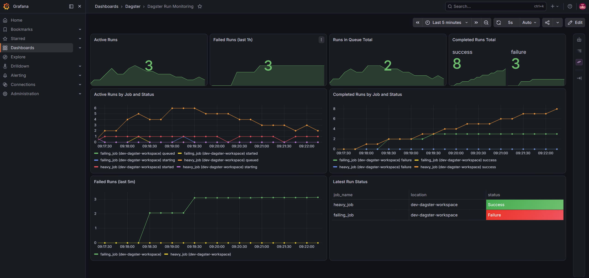
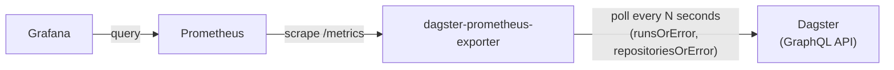

# dagster-prometheus-exporter

[](https://github.com/HirofumiTsuda/dagster-prometheus-exporter/releases/latest)
[](https://github.com/HirofumiTsuda/dagster-prometheus-exporter/actions/workflows/ci.yml)
[](https://codecov.io/gh/HirofumiTsuda/dagster-prometheus-exporter)
[](https://github.com/HirofumiTsuda/dagster-prometheus-exporter/actions/workflows/codeql.yml)
[](go.mod)
[](https://pkg.go.dev/github.com/HirofumiTsuda/dagster-prometheus-exporter)
[](LICENSE)

A Prometheus exporter for [Dagster](https://dagster.io/) run metrics. It polls Dagster's GraphQL API on an interval and exposes run counts, statuses, and code-location information as Prometheus metrics.



## Table of Contents

- [Quick Start](#quick-start)
- [Compatibility](#compatibility)
- [Motivation](#motivation)
- [Architecture](#architecture)
- [Metrics](#metrics)
- [Endpoints](#endpoints)
- [Usage](#usage)
- [Local development](#local-development)
- [Roadmap](#roadmap)
- [License](#license)

## Quick Start

`docker compose up` brings up the entire stack in one shot — a `dagster dev` instance with sample jobs, this exporter, Prometheus, and Grafana with the dashboard above pre-provisioned. No manual setup required.

```sh
docker compose up --build
```

| Service | URL | Notes |
| --- | --- | --- |
| Dagster UI | http://localhost:3000 | Sample jobs defined in `dev/dagster_workspace/`. |
| Exporter metrics | http://localhost:9101/metrics | |
| Prometheus | http://localhost:9090 | Scrapes the exporter using `dev/prometheus/prometheus.docker.yml`. |
| Grafana | http://localhost:3001 | Login `root` / `passw0rd` (local dev only). Dashboard "Dagster Run Monitoring" is auto-provisioned from `dev/grafana/dashboards/dagster-dashboard.json`. |

## Compatibility

Tested against Dagster **1.13.15** (the version pinned in `pyproject.toml`/`uv.lock` for the local dev stack). Dagster's GraphQL API isn't a stable, versioned contract — fields and types can change between releases — so this exporter isn't guaranteed to work against significantly older or newer Dagster versions. If you hit a GraphQL error running against a different version, please [open an issue](https://github.com/HirofumiTsuda/dagster-prometheus-exporter/issues/new/choose).

## Motivation

Dagster doesn't expose a native Prometheus metrics endpoint. The commonly suggested workaround is to push metrics from inside a run to a [Pushgateway](https://github.com/prometheus/pushgateway) using the [`dagster-prometheus`](https://docs.dagster.io/integrations/libraries/prometheus) resource, but that doesn't fit what we actually want to monitor:

1. Prometheus's own documentation discourages using the Pushgateway as a general pull-to-push workaround — it's meant only for short-lived batch jobs that genuinely can't be scraped, not as a substitute for exposing a scrapeable endpoint.
2. A push happens from code running *inside* a run. If a run is OOM-killed (or otherwise crashes) before it gets there, nothing is ever pushed — so exactly the failure you most want visibility into goes unobserved.
3. Runs sitting in the queue haven't started executing any user code yet, so there's no push to make at all — a push-based approach has no way to report run-queue backlog.

This exporter instead polls Dagster's GraphQL API directly and derives every metric (including queued/active runs) from Dagster's own run state, so none of the above gaps apply.

## Architecture



The exporter is a single Go binary with no external state store — everything it reports is held in memory and rebuilt on each scrape:

- `cmd/exporter` — entrypoint; loads config and starts the server.
- `internal/config` — reads settings from environment variables.
- `internal/server` — runs the HTTP server (`/metrics`, `/healthz`, `/readyz`) and a background ticker that triggers a scrape on `DAGSTER_SCRAPING_INTERVAL_SECONDS`.
- `internal/collector` — on each scrape, queries Dagster's GraphQL API (active runs, completed runs, and the job/code-location roster) and updates the in-memory state behind a mutex; `DagsterCollector` implements `prometheus.Collector` and renders that state into metrics whenever Prometheus scrapes `/metrics`.

Because scraping (writing state) and metrics rendering (reading state) are decoupled, a slow or failing Dagster GraphQL call never blocks or breaks a `/metrics` request — it just serves the last known state.

The three collectors (job/location roster, active runs, completed runs) run concurrently on every scrape — each locks `DagsterCollector`'s own mutex only around its own critical section, so they don't block each other or `/metrics`.

Fetching completed runs is incremental, not a full re-scan every cycle: after the first scrape (which backfills `LOOKBACK_WINDOW_MINUTES`), each subsequent scrape only asks Dagster for runs updated since the last-seen watermark (minus a small safety margin, to tolerate a run's DB write committing slightly after its `updateTime`). Any single fetch — the initial backfill or an unusually large batch of updates — pages through `runsOrError` via cursor (`RUNS_PAGE_SIZE` per page) and folds each page into the in-memory counters as it arrives, rather than buffering the full result set in memory first.

## Metrics

All metrics are labeled with `job_name` and `location` (the Dagster code location the job belongs to), so that jobs with the same name in different code locations don't collide.

| Metric | Type | Labels | Description |
| --- | --- | --- | --- |
| `dagster_active_runs` | Gauge | `job_name`, `location`, `status` | Number of currently active runs (`queued`, `starting`, `started`) per job. Jobs with no active runs are reported as `0` rather than omitted. |
| `dagster_completed_runs_total` | Counter | `job_name`, `location`, `status` | Total number of completed runs (`success`, `failure`) per job, since the exporter started. Jobs that have never run are seeded at `0`. Series for jobs that no longer exist in Dagster are deleted automatically. |
| `dagster_last_run_info` | Gauge | `job_name`, `location`, `status` | Always `1`; an "info" metric (same pattern as `kube_pod_info`) reporting the status of the most recently completed run per job. Kept until a newer completion supersedes it or the job is removed from Dagster — it does not disappear just because nothing has completed recently. Use the `status` label to tell success from failure, e.g. in a Grafana table panel. |

### Exporter self-health

These report on the exporter itself — whether its own scrapes of Dagster are succeeding — rather than on Dagster's run state. All three are labeled `collector`, one of `job_locations`, `active_runs`, or `completed_runs` (the three concurrent collectors described in [Architecture](#architecture)).

| Metric | Type | Labels | Description |
| --- | --- | --- | --- |
| `dagster_exporter_scrape_duration_seconds` | Gauge | `collector` | Duration of that collector's most recent scrape. |
| `dagster_exporter_last_scrape_success` | Gauge | `collector` | `1` if that collector's most recent scrape succeeded, `0` if it failed. |
| `dagster_exporter_scrape_errors_total` | Counter | `collector` | Total number of failed scrapes for that collector, since the exporter started. |

### Example output

```
dagster_active_runs{job_name="heavy_job",location="dev-dagster-workspace",status="queued"} 0
dagster_active_runs{job_name="heavy_job",location="dev-dagster-workspace",status="started"} 1
dagster_active_runs{job_name="heavy_job",location="dev-dagster-workspace",status="starting"} 0

dagster_completed_runs_total{job_name="heavy_job",location="dev-dagster-workspace",status="failure"} 0
dagster_completed_runs_total{job_name="heavy_job",location="dev-dagster-workspace",status="success"} 12
dagster_completed_runs_total{job_name="failing_job",location="dev-dagster-workspace",status="failure"} 3

dagster_last_run_info{job_name="heavy_job",location="dev-dagster-workspace",status="success"} 1
dagster_last_run_info{job_name="failing_job",location="dev-dagster-workspace",status="failure"} 1
```

### PromQL examples

```promql
# Total active runs across all jobs
sum(dagster_active_runs)

# Failed runs in the last hour, by job
sum by (job_name) (increase(dagster_completed_runs_total{status="failure"}[1h]))

# Success rate over the last 5 minutes
sum(rate(dagster_completed_runs_total{status="success"}[5m]))
/
sum(rate(dagster_completed_runs_total[5m]))

# Jobs whose last run failed
dagster_last_run_info{status="failure"}
```

## Endpoints

| Endpoint | Purpose | Example response |
| --- | --- | --- |
| `GET /metrics` | Prometheus exposition of all metrics above. | See [Example output](#example-output). |
| `GET /healthz` | Liveness probe. Always returns `200` as long as the process is up — it does not check Dagster connectivity, so it's safe to use for a container/k8s liveness check that shouldn't restart the pod just because Dagster is unreachable. | `200` `{"status":"healthy"}` |
| `GET /readyz` | Readiness probe. Calls Dagster's GraphQL API and returns `200` only if it responds, `503` otherwise — use this (not `/healthz`) to gate traffic/scrape readiness on Dagster actually being reachable. On success, the response body also includes the connected Dagster instance's version. | `200` `{"status":"OK","version":"1.13.15"}`, or `503` `{"status":"NOT_READY","error":"..."}` |

## Usage

Install directly with Go:

```sh
go install github.com/HirofumiTsuda/dagster-prometheus-exporter/cmd/exporter@latest
DAGSTER_GRAPHQL_ENDPOINT=http://localhost:3000/graphql exporter
```

Or clone and build it yourself:

```sh
go build -o exporter ./cmd/exporter
DAGSTER_GRAPHQL_ENDPOINT=http://localhost:3000/graphql ./exporter
```

Or pull the published image from GHCR:

```sh
docker run -p 9101:9101 -e DAGSTER_GRAPHQL_ENDPOINT=http://dagster:3000/graphql ghcr.io/hirofumitsuda/dagster-prometheus-exporter:latest
```

Or build it yourself:

```sh
docker build -f docker/exporter.Dockerfile -t dagster-prometheus-exporter .
docker run -p 9101:9101 -e DAGSTER_GRAPHQL_ENDPOINT=http://dagster:3000/graphql dagster-prometheus-exporter
```

Or deploy to Kubernetes with the [Helm chart](charts/dagster-prometheus-exporter), published as an OCI artifact on GHCR:

```sh
helm install my-dagster-exporter oci://ghcr.io/hirofumitsuda/charts/dagster-prometheus-exporter \
  --version 0.1.0 \
  --set env.DAGSTER_GRAPHQL_ENDPOINT=http://dagster-webserver.dagster.svc.cluster.local/graphql
```

Metrics are then available at `http://localhost:9101/metrics`.

### Configuration

All configuration is via environment variables (see `internal/config/config.go`):

| Variable | Default | Description |
| --- | --- | --- |
| `PORT` | `9101` | Port the exporter listens on. |
| `DAGSTER_GRAPHQL_ENDPOINT` | `http://127.0.0.1:3000/graphql` | URL of the Dagster GraphQL API to poll. |
| `LOOKBACK_WINDOW_MINUTES` | scraping interval | How far back to look for completed runs on the very first scrape only. After that, completed runs are fetched incrementally from the last-seen update time (see [Architecture](#architecture)), so this only matters for the initial backfill on startup. |
| `CACHE_TTL_MINUTES` | 20x the scraping interval | How long a completed run's ID is remembered, to avoid double-counting `dagster_completed_runs_total`. A still-relevant run gets touched (its TTL refreshed) on every scrape, so this really just bounds how many consecutive missed/failed scrapes are tolerated before risking a double count on recovery. |
| `DAGSTER_SCRAPING_INTERVAL_SECONDS` | `15` | How often the exporter polls Dagster's GraphQL API. |
| `DAGSTER_SCRAPING_TIMEOUT_SECONDS` | `10` | Timeout for a full scrape cycle (all three collectors, run concurrently). |
| `RUNS_PAGE_SIZE` | `500` | Max runs requested per GraphQL call; larger result sets are paged through via cursor. |
| `RUNS_UPDATED_AFTER_SAFETY_MARGIN_MINUTES` | `5` | Overlap subtracted from the incremental fetch watermark, to tolerate runs whose DB commit lands slightly after their `updateTime`. |

## Local development

See [Quick Start](#quick-start) to bring up the full stack via `docker compose up --build`.

If you're running the exporter directly on the host (not via `docker compose`) against the Dockerized Dagster/Prometheus stack, use `dev/prometheus/prometheus.host.yml` instead, which scrapes the host via its Docker bridge IP.

### Importing the dashboard manually

If you already have your own Grafana/Prometheus and just want the dashboard, import the JSON directly:

1. In Grafana, go to **Dashboards → New → Import**.
2. Upload (or paste the contents of) [`dev/grafana/dashboards/dagster-dashboard.json`](dev/grafana/dashboards/dagster-dashboard.json).
3. Point it at a Prometheus data source that's scraping this exporter.

### Running tests

```sh
go build ./...
go vet ./...
golangci-lint run ./...
go test ./...
```

CI (`.github/workflows/ci.yml`) runs all of the above on every push and pull request.

## Roadmap

- [x] Active runs
- [x] Completed runs (seeded for idle jobs, pruned for removed jobs)
- [x] Per-code-location labeling
- [x] Latest run status
- [ ] Run duration (latest completed, and longest-running active run per job)
- [x] Exporter self-health metrics (scrape duration/errors)
- [ ] Schedule tick status
- [ ] Sensor / asset materialization metrics
- [x] Published container image / tagged release
- [x] Helm chart for Kubernetes deployment

## License

MIT — see [LICENSE](LICENSE).
